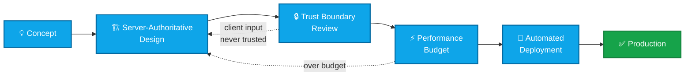

<!--
╔══════════════════════════════════════════════════════════════════════════════╗
║  NEBELREBELL · GITHUB PROFILE README                                         ║
║  FiveM / QB-Core Development · IT Automation · Applied AI                    ║
╚══════════════════════════════════════════════════════════════════════════════╝
-->

<!-- ── Blaue Wellen-Leiste (oben am Rand) ────────────────────────────────────── -->

  

<!-- ── Logo ──────────────────────────────────────────────────────────────────── -->

  

<!-- ── Schriftzug mit Farbverlauf ────────────────────────────────────────────── -->

  

<h3 align="center">
  FiveM-Script-Developer ·
  Community Founder &amp; Manager of the Multigaming Community
  <a href="https://nebelbank.net">Nebelbank.net</a> since 1997 ·
  Creative Streamer &amp; Gaming Pioneer since the C64 / Amiga 500 era
</h3>

<strong>[WIP] Nebelbank.net – Legacy RP – Back to the Roots</strong>

  

  
  
  
  
  

  
  
  

---

## `01` — About

**Founder and Manager of the Multigaming Community [Nebelbank.net](https://nebelbank.net) — since 1997.**

I have been building, breaking and rebuilding systems since the **C64 / Amiga 500** era. Today my work
sits at the intersection of three disciplines that turn out to reinforce each other remarkably well:

| Domain | What I actually do |
| :--- | :--- |
| **FiveM · QB-Core** | Server-authoritative resources, framework-level integrations, OneSync-safe state handling, performance budgets that survive a full server. |
| **IT Automation** | Deployment pipelines, scripted server operations, monitoring and self-healing infrastructure — removing every task that repeats. |
| **Applied AI** | LLM-assisted development workflows, agent tooling and automation that produces reviewable, production-ready output — not demos. |

> [!NOTE]
> **Current project — `Nebelbank.net · Legacy RP · Back to the Roots`** *(WIP)*
> A roleplay server built on the principle that stability and fair play beat feature bloat.

 

## `02` — Engineering Principles

Every resource I ship is measured against the same four gates. This is the flow a script goes through
before it ever reaches a live server:

<b>What each gate means in practice</b> — click to expand

 

**Server-Authoritative Design** — the client renders, the server decides. Money, inventory, jobs and
state transitions are validated server-side, always. No exceptions for convenience.

**Trust Boundary Review** — every `RegisterNetEvent` is treated as a public, hostile API. Payloads are
type-checked, rate-limited and bound to the caller's actual source. Events that mutate state are never
callable without validation.

**Performance Budget** — resources are profiled under load, not on an empty server. Threads run at the
lowest viable tick rate, loops exit early, and `Citizen.Wait(0)` is justified or removed.

**Automated Deployment** — no manual file copying, no "it works on my server". Reproducible builds,
scripted rollouts, verifiable rollbacks.

 

## `03` — Stack

<table align="center">
<tr>
<td align="center" width="33%">

**Core Development**

</td>
<td align="center" width="33%">

**Data & Infrastructure**

</td>
<td align="center" width="33%">

**Tooling & Workflow**

</td>
</tr>
</table>

  
  
  
  
  
  
  

 

## `04` — GitHub Activity

<picture>
  <source media="(prefers-color-scheme: dark)" srcset="https://github-readme-stats.vercel.app/api?username=nebelrebell&show_icons=true&hide_border=true&theme=tokyonight&bg_color=00000000&title_color=0ea5e9&icon_color=0ea5e9&text_color=94a3b8" />
  <source media="(prefers-color-scheme: light)" srcset="https://github-readme-stats.vercel.app/api?username=nebelrebell&show_icons=true&hide_border=true&bg_color=00000000&title_color=0369a1&icon_color=0369a1&text_color=334155" />
  
</picture>
<picture>
  <source media="(prefers-color-scheme: dark)" srcset="https://github-readme-stats.vercel.app/api/top-langs/?username=nebelrebell&layout=compact&hide_border=true&theme=tokyonight&bg_color=00000000&title_color=0ea5e9&text_color=94a3b8&langs_count=8" />
  <source media="(prefers-color-scheme: light)" srcset="https://github-readme-stats.vercel.app/api/top-langs/?username=nebelrebell&layout=compact&hide_border=true&bg_color=00000000&title_color=0369a1&text_color=334155&langs_count=8" />
  
</picture>

  

<picture>
  <source media="(prefers-color-scheme: dark)" srcset="https://github-readme-streak-stats.herokuapp.com/?user=nebelrebell&hide_border=true&background=00000000&stroke=1e293b&ring=0ea5e9&fire=0ea5e9&currStreakLabel=0ea5e9&sideLabels=94a3b8&dates=64748b&currStreakNum=e2e8f0&sideNums=e2e8f0" />
  
</picture>

  

<picture>
  <source media="(prefers-color-scheme: dark)" srcset="https://github-readme-activity-graph.vercel.app/graph?username=nebelrebell&theme=react-dark&bg_color=00000000&color=0ea5e9&line=0ea5e9&point=e2e8f0&area=true&area_color=0ea5e9&hide_border=true&custom_title=Contribution%20Activity" />
  <source media="(prefers-color-scheme: light)" srcset="https://github-readme-activity-graph.vercel.app/graph?username=nebelrebell&bg_color=00000000&color=0369a1&line=0369a1&point=1e293b&area=true&area_color=0ea5e9&hide_border=true&custom_title=Contribution%20Activity" />
  
</picture>

 

## `05` — Contribution Snake

<picture>
  <source media="(prefers-color-scheme: dark)" srcset="https://raw.githubusercontent.com/nebelrebell/nebelrebell/output/github-snake-dark.svg" />
  <source media="(prefers-color-scheme: light)" srcset="https://raw.githubusercontent.com/nebelrebell/nebelrebell/output/github-snake.svg" />
  
</picture>

 

## `06` — Support

  

---

 

<code>#FiveM</code> · <code>#QBCore</code> · <code>#Lua</code> · <code>#Roleplay</code> ·
<code>#ITAutomation</code> · <code>#AI</code> · <code>#OpenSource</code> · <code>#Nebelbank</code>

  

  

<!-- ── Blaue Wellen-Leiste (unten am Rand) ───────────────────────────────────── -->

